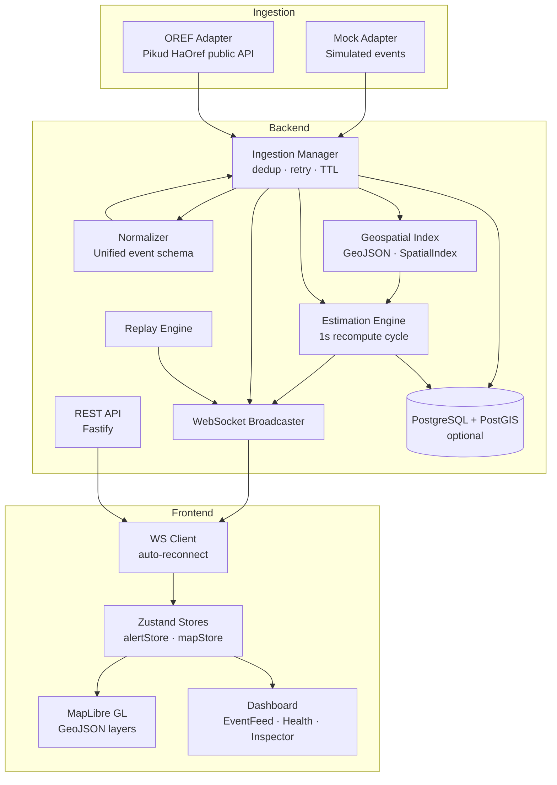

# Dynamic Alert Map

Real-time visualization of public alert events for Israel. Displays official alert areas and
derived estimated threat zones on a live interactive map.

> **DISCLAIMER:** Estimated zone polygons are visualizations derived solely from public alert
> event sequences. They are NOT trajectory predictions, military intelligence, or authoritative
> threat assessments. Always follow official guidance from emergency authorities.

---

## Architecture



---

## Quick Start (Local Dev — no Docker needed)

### Prerequisites
- Node.js 20+
- npm 9+
- (Optional) Docker + Docker Compose for PostgreSQL

### 1. Install dependencies

```bash
cd dynamic-alert-map
cp .env.example .env
npm install
```

### 2. Start the database (optional — system works without it)

```bash
docker-compose up -d postgres
# Wait ~5 seconds, then:
npm run migrate -w packages/backend
npm run seed -w packages/backend
```

### 3. Start backend + frontend

```bash
npm run dev
```

- Frontend: http://localhost:3000
- Backend REST: http://localhost:3001
- WebSocket: ws://localhost:3001/ws

---

## Docker (full stack)

```bash
cp .env.example .env
docker-compose up --build
```

---

## Environment Variables

See `.env.example` for all options. Key ones:

| Variable | Default | Description |
|---|---|---|
| `MOCK_INGESTION` | `true` | Enable mock event generator |
| `OREF_INGESTION` | `false` | Enable Pikud HaOref public API |
| `MOCK_EVENT_INTERVAL_MS` | `8000` | Interval between mock events |
| `BUFFER_KM` | `5` | Estimated zone buffer radius |
| `DECAY_MS` | `300000` | Zone expiry time (5 min) |
| `NEXT_PUBLIC_MAPTILER_KEY` | _(empty)_ | MapTiler API key for better tiles |

---

## Data Sources

| Source | Type | Notes |
|---|---|---|
| Mock generator | Internal | Simulated alert sequences for dev/demo |
| Pikud HaOref | Public API | Israeli Home Front Command public alerts |
| Geofences | Local GeoJSON | Approximate public area boundaries |

All sources are public. No classified or military data is used.

---

## Estimation Algorithm

The estimation engine runs every 1 second and:

1. **Collects** all ACTIVE events with a resolvable geofence polygon
2. **Unions** all active polygons into a single merged area
3. **Detects trend** — if ≥3 events within 10 minutes have calculable centroids and a consistent
   bearing/speed, a movement trend is recorded (purely heuristic from event sequence timing)
4. **Buffers** — uniform 5km buffer normally; directional buffer if trend confidence ≥ 50%
5. **Simplifies** geometry for rendering performance
6. **Creates uncertainty envelope** — 1.8× buffer at low opacity
7. **Computes confidence** — decays exponentially as events age; increases with event count
8. **Attaches explanation** — every zone includes a `notes[]` field explaining derivation

**Important:** The trend detection does NOT model ballistic trajectories. It simply observes
the time-sequenced pattern of public alerts and notes which direction new alerts are appearing.

---

## Project Structure

```
dynamic-alert-map/
├── packages/
│   ├── backend/
│   │   ├── src/
│   │   │   ├── config/          Config with env validation
│   │   │   ├── normalization/   Zod schema + normalizer for all sources
│   │   │   ├── ingestion/       Adapters (mock, oref) + dedup + retry
│   │   │   ├── geospatial/      GeoJSON loader + spatial index
│   │   │   ├── estimation/      Zone engine + algorithms
│   │   │   ├── streaming/       WebSocket broadcaster
│   │   │   ├── persistence/     PostgreSQL + migrations
│   │   │   ├── api/             REST routes (Fastify)
│   │   │   ├── replay/          Historical playback engine
│   │   │   └── server.ts        Bootstrap
│   │   ├── data/
│   │   │   ├── geofences.geojson   37 Israel alert areas
│   │   │   └── mock-events.json    33 historical events for replay/seed
│   │   └── tests/               Jest unit + integration tests
│   └── frontend/
│       └── src/
│           ├── types/           Shared TypeScript types
│           ├── store/           Zustand stores (alert, map, system)
│           ├── lib/             WebSocket client + REST API helpers
│           ├── hooks/           useWebSocket
│           └── components/
│               ├── Map/         MapLibre GL container + legend
│               ├── Dashboard/   EventFeed, Health, SourceStatus, Inspector
│               ├── Replay/      ReplayControls
│               └── common/      DisclaimerBanner
```

---

## API Reference

| Endpoint | Method | Description |
|---|---|---|
| `/health` | GET | System health + adapter statuses |
| `/api/events` | GET | Recent events (in-memory) |
| `/api/events/active` | GET | Currently active events only |
| `/api/events/history` | GET | Historical events (DB or memory) |
| `/api/zones` | GET | Current estimated zones |
| `/api/geofences` | GET | Static GeoJSON geofence collection |
| `/api/config` | GET | Runtime configuration |
| `/api/replay/start` | POST | Start historical replay |
| `/api/replay/pause` | POST | Pause replay |
| `/api/replay/resume` | POST | Resume replay |
| `/api/replay/stop` | POST | Stop replay |
| `/api/replay/seek` | POST | Seek to event index |
| `/api/replay/speed` | POST | Set speed (1, 5, 20) |
| `/ws` | WebSocket | Full real-time event stream |

---

## WebSocket Messages (Server → Client)

```typescript
{ type: 'init',         data: { events, zones, geofences } }
{ type: 'event',        data: NormalizedEventDTO }
{ type: 'event:expired',data: NormalizedEventDTO }
{ type: 'zones_update', data: EstimatedZone[] }
{ type: 'health',       data: HealthStatus }
{ type: 'source_status',data: AdapterStatus[] }
{ type: 'replay_state', data: ReplayState }
```

---

## Running Tests

```bash
npm run test -w packages/backend
```

Tests cover:
- Normalization (Zod schema, OREF parsing, multi-area splitting)
- Geospatial (loader, spatial index, name resolution, point containment)
- Estimation (union, buffer, decay, trend detection)
- API (Fastify integration tests)

---

## TODO / Future Improvements

- [ ] Add Redis pub/sub for horizontal scaling of WebSocket broadcast
- [ ] Add OREF historical API adapter for automated replay sessions
- [ ] Add PostGIS spatial queries for zone-event overlap analysis
- [ ] Add i18n support (Hebrew UI labels)
- [ ] Add time-series chart of alert frequency by region
- [ ] Add configurable decay curves per alert category
- [ ] Add alert sound notifications (opt-in)
- [ ] Export replay sessions to GeoJSON/video
- [ ] Add OpenTelemetry tracing
- [ ] Kubernetes manifests
- [ ] Add additional public alert sources (e.g., USGS earthquake feeds)
